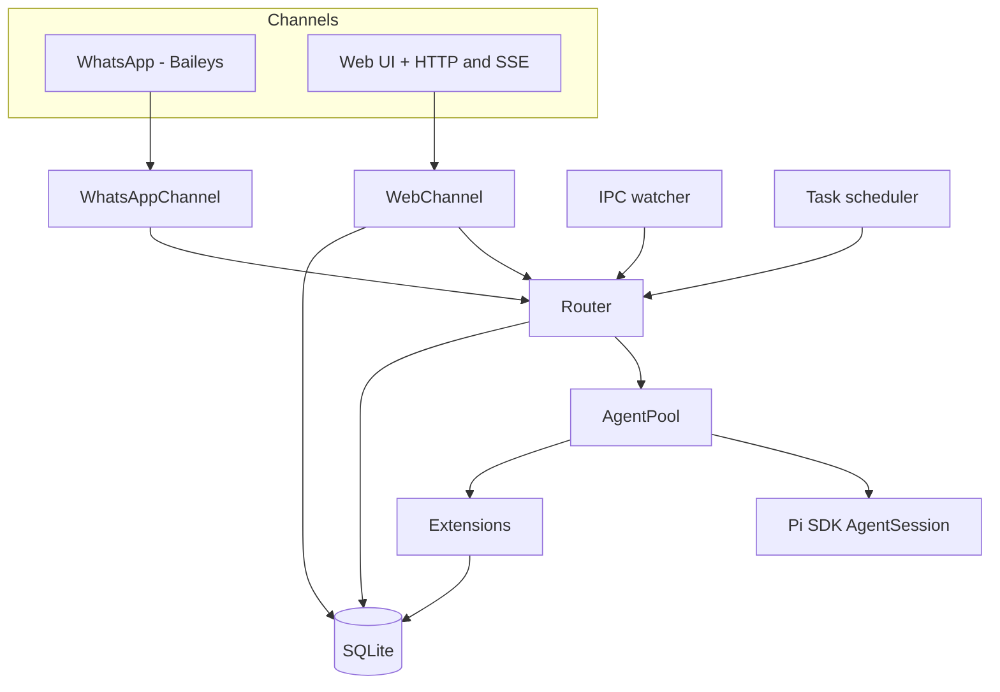

# Architecture

This document outlines the main components, how they fit together, and where the code lives.

## Component overview



## Code layout (high level)

```
piclaw/
├── src/
│   ├── index.ts                 # Entry point
│   ├── cli.ts                   # CLI parsing
│   ├── runtime.ts               # Service startup orchestration
│   ├── runtime/                 # Message loop + state management
│   ├── core/                    # Env, config, chat context (AsyncLocalStorage)
│   ├── router.ts                # Message routing
│   ├── queue.ts                 # Agent queue with retry
│   ├── queue/                   # Retry policy
│   ├── agent-pool.ts            # AgentSession pool + side-prompt primitive
│   ├── agent-pool/              # Session helpers, logging, slash commands
│   ├── agent-control/           # Slash command handling + parsers
│   ├── extensions/              # Inline extension factories
│   ├── channels/                # WhatsApp + Web channels
│   │   └── web/                 # HTTP handlers, SSE, adaptive cards, workspace, auth, extension routes
│   ├── tools/                   # Bash tracking + context wrappers
│   ├── db/                      # SQLite schema + accessors
│   ├── db.ts                    # Legacy DB re-export
│   ├── secure/                  # Keychain (AES-256-GCM)
│   ├── utils/                   # Shared helpers (ids, preview, model utils)
│   ├── workspace-search.ts      # FTS over workspace files
│   ├── task-scheduler.ts        # Cron/interval scheduling
│   ├── tool-output.ts           # Stored tool output management
│   ├── ipc.ts                   # IPC file watcher
│   └── types.ts                 # Shared type definitions
├── extensions/                  # Packaged filesystem-backed runtime extensions
│   ├── browser/                 # Browser automation extensions
│   │   └── cdp-browser/         # Chromium CDP browser control extension
│   ├── platform/                # Platform-specific packaged extensions
│   │   └── windows/
│   │       └── win-ui/          # Windows desktop automation extension
│   ├── integrations/            # Packaged integration/helper extensions
│   │   ├── azure-openai.ts      # Azure OpenAI/Foundry provider (optional)
│   │   └── context-mode.ts      # Tool output + exec_batch extension
│   ├── viewers/                 # Route-backed viewers and editor surfaces
│   │   ├── drawio-editor/       # Self-hosted draw.io editor extension
│   │   ├── editor/              # Standalone editor web pane extension
│   │   └── office-viewer/       # Lightweight JS Office document viewer extension
│   └── experimental/            # Harness-only or experimental entries
│       └── azure-openai.harness.ts
└── web/
    ├── src/
    │   ├── app.ts               # Main Preact app
    │   ├── api.ts               # HTTP/SSE client
    │   ├── components/          # UI components (timeline, compose, etc.)
    │   ├── panes/               # Pane system infrastructure
    │   │   ├── pane-types.ts    # WebPaneExtension contracts
    │   │   ├── pane-registry.ts # PaneRegistry singleton
    │   │   ├── editor-loader.ts # Lazy proxy for editor bundle
    │   │   ├── tab-store.ts     # Framework-agnostic tab state
    │   │   ├── terminal-pane.ts # Terminal dock scaffold
    │   │   ├── vnc-pane.ts      # VNC remote-display pane (RFB client)
    │   │   ├── remote-display-protocol.ts # Remote display protocol interface + events
    │   │   ├── remote-display-socket.ts # Transport wrapper (metrics + control messages)
    │   │   ├── remote-display-decoder.ts # WASM fast-path decoder + JS fallback
    │   │   ├── remote-display-vnc.ts # VNC protocol adapter (negotiation + frame parsing)
    │   │   ├── drawio-pane.ts   # Draw.io editor pane (iframe embed)
    │   │   ├── office-viewer-pane.ts  # Office document viewer pane (iframe route-backed)
    │   │   ├── csv-viewer-pane.ts     # CSV/TSV table viewer pane
    │   │   ├── pdf-viewer-pane.ts     # PDF viewer pane
    │   │   ├── image-viewer-pane.ts   # Image viewer pane
    │   │   └── workspace-preview-pane.ts # Default workspace preview pane
    │   ├── ui/                  # Hooks + state management (queue helpers, windowing, optional API fallbacks, mobile viewport recovery)
    │   ├── vendor/              # Vendored libs (preact-htm, mermaid)
    │   └── styles/              # CSS source
    └── static/                  # Served files (HTML, built bundles, icons)
```

## Extensions

### Inline extension factories

These are compiled into the package and registered via `extensionFactories` on the resource loader:

| Factory | Tools / Commands |
|---------|-----------------|
| `fileAttachments` | `attach_file` |
| `messagesCrud` | `messages` |
| `workspaceSearch` | `search_workspace` |
| `modelControl` | `get_model_state`, `list_models`, `switch_model`, `switch_thinking` |
| `scheduledTasks` | `schedule_task`, `/tasks`, `/scheduled` slash commands |
| `sqlIntrospect` | `introspect_sql` (read-only SQLite queries) |
| `internalTools` | `list_internal_tools` |
| `sendAdaptiveCard` | `send_adaptive_card` for agent-owned Adaptive Card posting |
| `uiThemeExtension` | `/theme`, `/tint` web UI theme controls |
| `smartCompaction` | Smart compaction via `session_before_compact` hook (DB-driven file lists, junk-path filtering) |

Each factory receives an `ExtensionAPI` and registers tools or slash commands via `pi.registerTool()` and `pi.registerSlashCommand()`. System prompt hints are injected via `pi.on("before_agent_start")`.

### Bundled runtime extensions

In addition to the inline factories, piclaw ships **packaged runtime extensions** under `extensions/` in the package tree. These are loaded via jiti at session start; some are always enabled and others are gated on environment variables:

| Extension | Gate | Purpose |
|-----------|------|---------|
| `integrations/azure-openai.ts` | `AOAI_BASE_URL` must be set | Azure OpenAI + Foundry provider with managed-identity or API-key auth |
| `integrations/context-mode.ts` | Always loaded | Tool-output storage, search handles, and `exec_batch` tool |
| `integrations/keychain/` | Always loaded | `keychain` tool for list/get/set/delete of secure entries |
| `integrations/ssh/` | Always loaded | `ssh` agent-only tool for session-scoped SSH profile `get`/`set`/`clear` |
| `integrations/proxmox/` | Always loaded | `proxmox` agent-only tool for session-scoped Proxmox profile actions plus `discover`, `capabilities`, `workflow_help`, `recommend`, raw `request`, and named `workflow` actions |
| `integrations/portainer/` | Always loaded | `portainer` agent-only tool for session-scoped Portainer profile actions plus `discover`, `capabilities`, `workflow_help`, `recommend`, raw `request`, and named `workflow` actions |
| per-session `ssh-core` session extension | Created per session by `AgentPool` | Wraps `read`/`write`/`edit`/`bash` with session-scoped local-or-remote SSH execution |
| `browser/cdp-browser/` | Always loaded | Cross-platform Chromium CDP browser control tool (`cdp_browser`) |
| `platform/windows/win-ui/` | Always loaded (runtime no-op off Windows) | Windows desktop automation via bun:ffi + IAccessible (`win_*` tools) |
| `viewers/drawio-editor/` | Always loaded | Self-hosted draw.io editor with extension route, save endpoint, and workspace export |
| `viewers/office-viewer/` | Always loaded | Lightweight JS Office document viewer with extension route |

These packaged runtime extensions use relative imports into `runtime/src/...` where needed and require a `node_modules` symlink next to the `extensions/` directory (created automatically at startup) so jiti can resolve deep package imports. `runtime/src/extensions/` remains a separate built-in factory surface and should not be confused with the filesystem-backed packaged extension tree.

For infrastructure integrations, the intended uniform contract is:
- session-scoped profile actions: `get` / `set` / `clear`
- instance discovery: `discover`
- compact introspection: `capabilities` / `workflow_help`
- intent routing: `recommend`
- raw transport surface: `request`
- reusable higher-level orchestration: `workflow`

`proxmox` and `portainer` now both follow that model directly, and future infrastructure integrations should mirror the same contract rather than introducing separate control shapes.

This contract is also a context-conservation strategy: compact family summaries come first, recommendations stay short, workflow examples are opt-in, and raw `request` is reserved for the cases where curated workflows are not enough.

### Web pane extensions

The web UI uses a separate **pane extension** system for content-area components. These are client-side only and live in `extensions/` (editor) or `web/src/panes/` (core infrastructure):

| Extension | Placement | Location |
|-----------|-----------|----------|
| `editor` | tabs | `extensions/viewers/editor/editor-extension.ts` |
| `drawio` | tabs | `web/src/panes/drawio-pane.ts` |
| `office-viewer` | tabs | `web/src/panes/office-viewer-pane.ts` |
| `csv-viewer` | tabs | `web/src/panes/csv-viewer-pane.ts` |
| `pdf-viewer` | tabs | `web/src/panes/pdf-viewer-pane.ts` |
| `image-viewer` | tabs | `web/src/panes/image-viewer-pane.ts` |
| `workspace-preview` | tabs | `web/src/panes/workspace-preview-pane.ts` |
| `terminal` | dock | `web/src/panes/terminal-pane.ts` |
| `terminal-tab` | tabs | `web/src/panes/terminal-pane.ts` |
| `vnc-viewer` | tabs | `web/src/panes/vnc-pane.ts` |

The editor extension is lazy-loaded as a separate bundle (`editor.bundle.js`, 889 KB) on first file open. Specialized viewers (draw.io, office, CSV, PDF, image) use route-backed iframes served through the extension route system, and their workspace-preview affordances now normalize around explicit “Edit/Open in Tab” promotion actions. See [web-pane-extensions.md](web-pane-extensions.md) for the pane contract and [extension-ui-contract.md](extension-ui-contract.md) for how pane extensions fit alongside timeline-native UI and the lower-level `extension_ui_*` bridge.

## Web UI loading sequence

```
Page load
  ├── index.html loads:
  │   ├── app.bundle.css (415 KB) ─── all styles
  │   ├── marked.min.js ───────────── markdown parser (global)
  │   ├── katex.min.js ────────────── math rendering (global)
  │   ├── beautiful-mermaid.js ─────── diagram rendering (global)
  │   └── app.bundle.js (185 KB) ──── core app (Preact, timeline, compose, panes)
  │
  ├── app.ts init:
  │   ├── import panes/index.ts
  │   │   ├── pane-types.ts ────────── contracts (types only, zero runtime)
  │   │   ├── pane-registry.ts ─────── PaneRegistry singleton
  │   │   ├── editor-loader.ts ─────── LazyEditorInstance proxy + editorPaneExtension
  │   │   ├── terminal-pane.ts ─────── Terminal dock/tab pane extension (feature-flagged)
  │   │   ├── vnc-pane.ts ──────────── VNC pane extension (tabs)
  │   │   └── tab-store.ts ────────── TabStore singleton
  │   │
  │   ├── paneRegistry.register(editorPaneExtension) ← loader proxy, NOT real editor
  │   ├── paneRegistry.register(terminalPaneExtension) ← if terminal feature is enabled
  │   ├── paneRegistry.register(terminalTabPaneExtension) ← adds `piclaw://terminal`
  │   └── paneRegistry.register(vncPaneExtension) ← enables `piclaw://vnc`
  │
  └── First file opened:
      ├── paneRegistry.resolve({path}) → editorPaneExtension (loader)
      ├── editorPaneExtension.mount(container, context)
      │   └── new LazyEditorInstance()
      │       ├── Shows "Loading..." spinner
      │       ├── import('/static/dist/editor.bundle.js') ← 889 KB, one-time
      │       │   └── exports { StandaloneEditorInstance, editorPaneExtension }
      │       ├── new mod.StandaloneEditorInstance(container, context)
      │       ├── Replays queued callbacks (dirty, save, close, viewState)
      │       └── Removes spinner, editor ready
      └── Subsequent files: editorModuleCache hit, instant mount
```

## Bundle sizes

| Bundle | Size | Contents |
|--------|------|----------|
| `app.bundle.js` | 185 KB | Core app: Preact, timeline, compose box, pane registry, tab store, workspace explorer |
| `editor.bundle.js` | 889 KB | CodeMirror 6 + languages + themes (lazy-loaded) |
| `login.bundle.js` | 2.2 KB | Login page |
| `app.bundle.css` | 415 KB | All styles |

## Notes

- The agent pool keeps one warm session per chat JID and evicts idle sessions after a TTL.
- The web UI is the primary interface; the WhatsApp channel is optional (skipped entirely when `WHATSAPP_PHONE` is not configured).
- Web and WhatsApp share the same storage and agent pool.
- Core utilities (config/env/chat context) live in `src/core`; shared helpers live in `src/utils`.
- Chat context (chat JID + channel) is tracked in AsyncLocalStorage; tools/extensions read from the scoped context (defaults to `web:default` / `web`) rather than env variables.
- SSH-backed core-tool state is session-scoped and persisted in SQLite (`ssh_configs`). `AgentPool` injects a per-session `ssh-core` extension and can hot-swap the live SSH backend for an existing warm session.
- Proxmox and Portainer API profiles are also session-scoped and persisted in SQLite (`proxmox_configs`, `portainer_configs`). Their native tools share the same low-context discovery pattern: `discover` → `capabilities` / `recommend` → `workflow_help` → `workflow` or `request`.
- Workspace tree responses are cached briefly (1s) and rate-limited to prevent bursty UI reloads (HTTP 429 when exceeded).
- The **workspace explorer** is a responsive sidebar (visible on desktop/tablet ≥1024px landscape) that shows a file tree of `/workspace`, supports file previews, drag-and-drop upload, inline file creation, inline rename, drag-and-drop move, and file reference pills for prompts.
- The **code editor** is a standalone pane extension (`extensions/viewers/editor/`) using CodeMirror 6 directly (no Preact wrapper). It opens in the tabbed content area when a file is clicked in the explorer. Supports syntax highlighting for 12 languages, search/replace, line wrapping, dirty tracking, Cmd+S save, vim mode, whitespace toggle, and accent-aware theming. The editor bundle is lazy-loaded on first file open. Backend endpoints: `GET /workspace/file?mode=edit` (full content up to 256 KB) and `PUT /workspace/file` (save).
- **Adaptive Cards** are rendered in the web timeline from `content_blocks` using the vendored Microsoft `adaptivecards` SDK. Action handling routes through `POST /agent/card-action`; submissions are also persisted as `adaptive_card_submission` blocks so the timeline can render compact receipts instead of raw text fallbacks. Finished cards are re-rendered with their submitted values populated, inputs locked read-only, and a concise state banner. Agent-owned cards should be posted through the internal `send_adaptive_card` tool (or equivalent agent-response message path) rather than a local slash command.
- The **tab strip** provides multi-file editing with dirty indicators, pin support, MRU-based tab switching, context menus (Close / Close Others / Close All / Pin / Preview), and keyboard shortcuts (Ctrl+Tab, Ctrl+W).
- Operational remote surfaces:
  - `piclaw://terminal` opens the terminal tab (`TERMINAL_TAB_PATH`) via `GET /terminal/session` and `GET /terminal/ws`/`WebSocket` upgrades.
  - `piclaw://vnc[/<target>]` opens the VNC pane via `GET /vnc/session` and `GET /vnc/ws`/`WebSocket` upgrades, then brokers raw TCP to the target (`WebSocketTcpBridge` + `VncSessionService`).
- **Markdown preview** is available for `.md` / `.mdx` / `.markdown` files via the tab context menu → Preview. Shows a live split-view with a resizable splitter.
- **Message permalinks**: clicking a timeline timestamp inserts a `message:{id}` pill in the compose box; Ctrl+Click copies a shareable URL; clicking a reference scrolls to and highlights the target.
- **Multi-turn threading**: when the agent produces multiple turns in a single response, subsequent turns are stored with a `thread_id` pointing to the first turn's message. The UI renders threaded replies indented with a left border.
- **Context usage / compaction affordance**: the compose footer reads `/agent/context` for current context-window usage, and the web app refreshes that state on initial connect, SSE reconnect, focus, `pageshow`, and visible-again transitions so the compaction affordance restores promptly when returning to the tab.
- **Standalone mobile/PWA recovery**: the web shell keeps a synced `--app-height` from `visualViewport` on standalone mobile runtimes and re-syncs it on focus / pageshow / visibility return to reduce whole-page jumps when resuming the app and focusing the compose textarea.
- Scheduled tasks are isolated using the **session tree**: before a task runs, the current tree position is saved; after the task, the tree is navigated back. The task's output stays in a side branch without polluting conversation context. If the task uses a different model, it is restored afterwards. See [runtime-flows.md](runtime-flows.md) for details.
- Scheduled tasks validate the requested model at creation time; invalid or ambiguous model names are rejected before the task is persisted.

For the message‑level flow, see [runtime-flows.md](runtime-flows.md).

## Additional documentation

- [Web pane extensions](web-pane-extensions.md) — first-class pane host contract for editors/viewers/tools in tabs and dock
- [Extension UI contract](extension-ui-contract.md) — when to use pane extensions vs timeline UI vs the `extension_ui_*` bridge
- [Turn mechanism audit](turn-mechanism-audit.md) — full-stack audit: state machine, queue/steering, crash recovery, client architecture, and data flow diagrams
